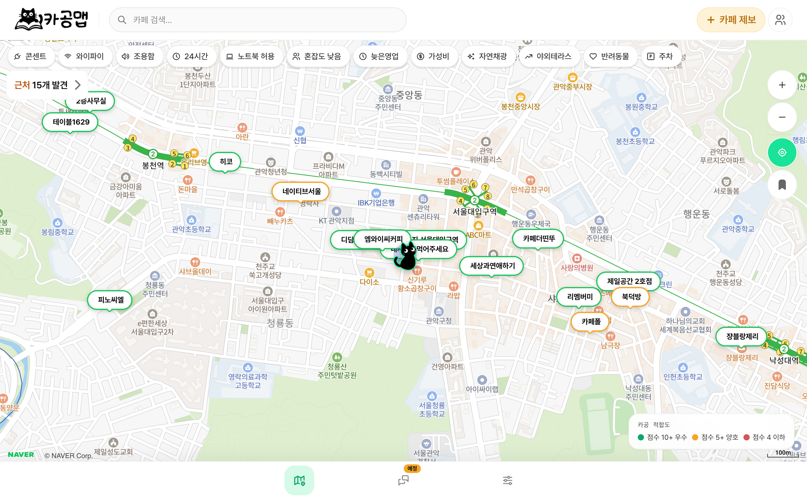

# 카공맵 (KaGongMap)

<p align="center">
  
</p>

> 카공족이 직접 만드는 카페 지도 커뮤니티

콘센트, 와이파이, 소음 수준, 시간 제한 여부 등 **카공 특화 정보**를 지도 위에서 함께 공유합니다.  
네이버 지도·카카오맵에선 볼 수 없는, 카공족 시점의 실용 정보를 제공합니다.

---

## 주요 기능

| 기능              | 설명                                                                   |
| ----------------- | ---------------------------------------------------------------------- |
| 🗺️ 카페 지도 탐색 | 현재 위치 기반 주변 카공 카페 탐색, 커스텀 핀 표시                     |
| 🔍 카공 필터 검색 | 콘센트·와이파이·조용함·24시간·시간제한없음 등 다중 AND 필터            |
| ➕ 카페 등록      | 3단계 폼 (기본정보 → 카공태그 → 사진 업로드)                           |
| 📄 카페 상세      | 카공 태그, 사진 갤러리, 평균 별점, 후기 목록                           |
| ⭐ 후기 & 별점    | 방문 기반 별점 + 카공 태그 + 후기 본문 작성                            |
| 🔖 즐겨찾기       | 자주 가는 카공 카페 북마크 (낙관적 업데이트)                           |
| 👤 마이페이지     | 즐겨찾기 / 내가 등록한 카페 / 내 후기 관리                             |
| 🤖 AI 자동 제보   | (어드민 전용) 본인 PC Claude CLI 로 카페 정보 자동 조사 → 검수 후 등록 |

### 카공 태그

| 태그             | 설명                                |
| ---------------- | ----------------------------------- |
| 🔌 콘센트 있음   | 노트북 충전 가능한 콘센트 자리 있음 |
| 📶 와이파이 있음 | 와이파이 제공                       |
| 🤫 조용함        | 대화 소음이 적고 집중하기 좋음      |
| 🌙 24시간        | 24시간 운영                         |
| 💻 노트북 허용   | 노트북 사용 환영                    |
| 🪑 혼잡도 낮음   | 자리 잡기 쉽고 여유 있음            |

---

## 기술 스택

| 레이어          | 기술                               |
| --------------- | ---------------------------------- |
| Frontend        | Next.js 16 (App Router)            |
| Styling         | Tailwind CSS                       |
| 지도            | 네이버 지도 API                    |
| Backend & Auth  | Supabase (PostgreSQL + Auth + RLS) |
| 이미지 스토리지 | Supabase Storage                   |
| 배포            | Vercel                             |

---

## 기술적 의사결정

### 1. Tier 기반 데이터 로딩

마커용 가벼운 페이로드(`CafeMarker` — 이름·좌표·태그·like_count)와 상세 모달용 무거운 페이로드(`CafeWithDetail` — 이미지·후기·영업시간 등)를 [`lib/api/cafes.ts`](lib/api/cafes.ts)에서 분리. 첫 렌더는 마커 정보만 fetch하고, 상세는 핀 클릭 시점에 lazy fetch. 마커 수가 늘어도 초기 페이로드 일정.

### 2. 다층 보안 (RLS + service-role API + NextAuth 가드)

- **DB**: Supabase RLS 정책으로 row-level 권한 강제 ([`docs/DB_SCHEMA.md`](docs/DB_SCHEMA.md))
- **API**: 모든 mutation을 service-role API route 경유 → 클라이언트는 anon-key로 read-only
- **라우트**: 어드민 라우트는 [`lib/adminAuth.ts`](lib/adminAuth.ts)의 `requireAdminApiAccess()` 통과 필수

→ anon-key가 노출돼도 mutation 불가능. service-role-key는 서버에만 존재.

### 3. 모달 기반 UX (라우트 폭발 방지)

카페 등록·상세·수정·후기는 별도 페이지 없이 메인 지도 위 모달로 처리. [`stores/modalStore.ts`](stores/modalStore.ts)에 모달 상태를 Zustand로 관리. 라우트 변경 없이 인터랙션이 끝나서 지도 컨텍스트(viewport·선택 상태)가 그대로 보존됨.

### 4. AI 자동 제보 — 어드민 PC ↔ 클라우드 협업

`/admin/auto-submit`은 어드민 본인 PC에서 도는 로컬 브릿지(`localhost:7332`)를 호출 → 브릿지가 `claude` CLI를 spawn해 카페 정보 조사 → JSON으로 응답 → 검수 후 클라우드 DB에 `pending`으로 등록. LLM 비용/실행을 클라우드와 분리하고 오프라인 검수 단계를 둔 설계. 상세는 [`docs/AUTO_SUBMIT.md`](docs/AUTO_SUBMIT.md).

### 5. 거대 컴포넌트 리팩토링 + 알고리즘 최적화

300줄+ 파일 4개를 책임 단위로 분리, props drilling 제거, 지도 마커 갱신 로직 **O(n² log n) → O(n)** 개선 (200카페 기준 ~300k → ~200 ops). 분리 도구 선택 기준(컴포넌트 vs 훅), 동작 보존 원칙 등 의사결정 근거는 [`docs/REFACTORING.md`](docs/REFACTORING.md).

---

## 시작하기

### 사전 요구사항

- Node.js 18+
- Supabase 프로젝트
- 네이버 지도 API 키

### 환경변수 설정

프로젝트 루트에 환경별 `.env*` 파일을 생성하고 아래 값을 입력합니다.

- `npm run dev`: `.env.development.local` 값을 우선 사용합니다.
- 배포/운영: Vercel Environment Variables 또는 운영용 `.env` 값에 실제 서버 정보를 설정합니다.
- `.env*` 파일은 비밀키가 포함되므로 커밋하지 않습니다.

```bash
NEXT_PUBLIC_SITE_URL=your_site_url
NEXTAUTH_URL=your_site_url
NEXTAUTH_SECRET=your_secret

NEXT_PUBLIC_SUPABASE_URL=your_supabase_url
NEXT_PUBLIC_SUPABASE_ANON_KEY=your_supabase_anon_key

SUPABASE_SERVICE_ROLE_KEY=your_supabase_service_role_key
ADMIN_USER_IDS=your_nextauth_user_id

NEXT_PUBLIC_NAVER_MAP_CLIENT_ID=your_naver_map_client_id
NAVER_MAP_CLIENT_SECRET=your_naver_map_client_secret

KAKAO_REST_API_KEY=your_kakao_rest_api_key
KAKAO_CLIENT_SECRET=your_kakao_client_secret

CLOUDFLARE_ACCOUNT_ID=your_cloudflare_account_id
CLOUDFLARE_IMAGES_API_TOKEN=your_cloudflare_images_api_token
NEXT_PUBLIC_CLOUDFLARE_IMAGES_URL=your_cloudflare_images_delivery_hash
```

개발 환경 예시는 아래처럼 테스트 서버 값을 넣습니다.

```bash
# .env.development.local
NEXT_PUBLIC_SITE_URL=http://localhost:3000
NEXTAUTH_URL=http://localhost:3000
NEXTAUTH_SECRET=your_dev_secret

NEXT_PUBLIC_SUPABASE_URL=your_test_supabase_url
NEXT_PUBLIC_SUPABASE_ANON_KEY=your_test_supabase_anon_key
SUPABASE_SERVICE_ROLE_KEY=your_test_supabase_service_role_key
ADMIN_USER_IDS=your_nextauth_user_id

NEXT_PUBLIC_NAVER_MAP_CLIENT_ID=your_test_naver_map_client_id
NAVER_MAP_CLIENT_SECRET=your_test_naver_map_client_secret

KAKAO_REST_API_KEY=your_test_kakao_rest_api_key
KAKAO_CLIENT_SECRET=your_test_kakao_client_secret

CLOUDFLARE_ACCOUNT_ID=your_test_cloudflare_account_id
CLOUDFLARE_IMAGES_API_TOKEN=your_test_cloudflare_images_api_token
NEXT_PUBLIC_CLOUDFLARE_IMAGES_URL=your_test_cloudflare_images_delivery_hash
```

### 설치 및 실행

```bash
# 의존성 설치
npm install

# 개발 서버 실행
npm run dev
```

[http://localhost:3000](http://localhost:3000)에서 확인합니다.

### DB 마이그레이션

Supabase 대시보드 SQL 에디터에서 `docs/DB_SCHEMA.md`의 SQL을 순서대로 실행합니다.

---

## 어드민 AI 자동 제보 (선택)

어드민이 `/admin/auto-submit` 페이지를 사용하려면 **본인 PC 에 별도의 로컬 브릿지를 설치**해야 합니다. 브릿지는 `claude` CLI 를 호출해 카페 정보(영업시간 · 최소 주문 금액 · 소개 · 카공 태그)를 자동으로 조사한 뒤, 어드민이 검수 후 `cafe_submissions` 에 `pending` 으로 등록하는 흐름입니다.

### 동작 모델

```
어드민 브라우저 (배포본 또는 localhost)
   │  ① 카카오에서 카페 검색 → 선택 → "AI 조사 시작"
   ▼
http://localhost:7332  (본인 PC 의 로컬 브릿지)
   │  ② claude CLI spawn → 웹 검색 → JSON 응답
   │  ③ 어드민이 결과 검수 후 "대기 큐로 제출"
   ▼
POST /api/admin/auto-submissions  (어드민 가드)
   │
   ▼
cafe_submissions INSERT (status='pending')
   │
   ▼
/admin "대기 중" 탭에서 최종 승인 → 트리거가 cafes 생성
```

브릿지는 **본인 PC 에서만** 동작하며, 모바일은 미지원입니다 (브라우저가 본인 PC localhost 를 호출하는 구조라 PC 가 켜져 있어야 함).

### 셋업 흐름

브릿지는 별도 깃허브 레포로 관리됩니다. 자세한 셋업은 브릿지 레포의 README 를 참고:

> **브릿지 레포**: `https://github.com/<OWNER>/kagongmap-auto-submit-bridge`

요약:

```bash
# 1. 브릿지 클론
git clone https://github.com/ChanGeunPark/auto-submit-bridge
cd kagongmap-auto-submit-bridge
npm install

# 2. .env 생성 + 토큰 입력
cp .env.example .env
#   → BRIDGE_TOKEN 을 긴 랜덤 문자열로 (openssl rand -hex 32)

# 3. 실행
npm run bridge   # 수동 실행 — 터미널 닫으면 종료
#   또는
#   LaunchAgent 로 macOS 자동 시작 (브릿지 레포 README 참조 — 추천)
```

### 카공맵 측 환경변수 추가

브릿지의 `BRIDGE_TOKEN` 과 동일한 값을 카공맵의 환경변수에도 등록해야 합니다.

```bash
# .env.development.local (또는 .env.local) 에 추가
NEXT_PUBLIC_BRIDGE_URL=http://localhost:7332
NEXT_PUBLIC_BRIDGE_TOKEN=<브릿지 .env 의 BRIDGE_TOKEN 과 동일값>
```

배포 환경에서도 사용하려면 Vercel Project Settings → Environment Variables 에 동일하게 등록 후 재배포.

> `NEXT_PUBLIC_*` 은 빌드 타임에 클라이언트 번들로 인라인되므로, 변경 후 dev 서버 재시작 + 브라우저 hard reload (`Cmd+Shift+R`) 필수.

### 사용

1. 본인 PC 에 브릿지 실행 (`npm run bridge` 또는 LaunchAgent 자동 시작)
2. 카공맵 어드민 → 우측 상단 **"✨ AI 자동 제보"** 또는 직접 `/admin/auto-submit`
3. 우측 상단 배지가 ●초록 **"브릿지 연결됨"** 인지 확인
4. 카카오 검색 → 카페 선택 → "AI 조사 시작" → 1~2분 후 "검토하기" → 검수 후 제출
5. `/admin` "대기 중" 탭에서 최종 승인 (클릭 한 번)

---

## 폴더 구조

> 카페 등록·상세·수정·후기 작성은 모두 **모달 기반** (`/cafes/*` 별도 페이지 없음). 모든 카페 인터랙션은 메인 지도 위에서 일어난다. 자세한 트리는 [`docs/ARCHITECTURE.md`](docs/ARCHITECTURE.md).

```
kagongmap/
├── app/                       # Next.js App Router
│   ├── layout.tsx             # 루트 레이아웃 (Providers · Analytics · 토스트)
│   ├── page.tsx               # 메인 지도 (/) [PUBLIC]
│   ├── login/                 # 로그인 [PUBLIC]
│   ├── mypage/                # 마이페이지 [AUTH]
│   ├── privacy/               # 개인정보처리방침
│   ├── admin/                 # 어드민 콘솔 [ADMIN]
│   │   └── auto-submit/       # AI 자동 제보 [ADMIN]
│   └── api/                   # Route Handlers (NextAuth + Supabase service-role)
├── components/
│   ├── MainApp.tsx            # 메인 지도 클라이언트 컨테이너
│   ├── auth/                  # AuthGate
│   ├── cafe/
│   │   ├── card/              # CafeCard
│   │   ├── form/              # CafeInfoForm 3단계 + ImageUploader · TagSelector · AddressSearch
│   │   └── detail/            # CafeModalDetail · 후기 · 사진/정보수정 제보 모달
│   ├── layout/                # TopNav · FilterBar · BottomSheet · CafeSidebar · Analytics 트래커
│   ├── map/                   # MapCanvas · CafePin · CafeMarkerClusterer
│   ├── modal/                 # BottomSheetModal · GlobalModal · 기타 모달
│   ├── notifications/         # FCM 토글 · ForegroundFcmListener
│   ├── pwa/                   # 설치 배너 · ServiceWorker 등록
│   ├── badge/ button/ input/ holder/ ui/   # 공용 UI 프리미티브
│   └── tweaks/                # [DEV] 디자인 토글 패널
├── hooks/                     # useFilteredCafes · useLikes · useBookmarks · useMapGeolocation 등
│   └── storage/               # SSR 안전 localStorage 래퍼
├── lib/
│   ├── api/                   # 도메인별 fetch + React Query 훅 (cafes · reviews · likes · ...)
│   ├── supabase/              # 브라우저 · 서버(service_role) 클라이언트
│   ├── firebase/              # Analytics · FCM · Admin SDK · sendPush
│   ├── auth.ts                # NextAuth 옵션 (Kakao + Google)
│   ├── adminAuth.ts           # 어드민 가드 헬퍼
│   ├── scoring.ts             # 카공/데이트/대화 점수 가중치
│   └── data.ts                # 필터 · 태그 정의
├── providers/                 # AuthProvider · QueryProvider
├── stores/                    # Zustand (cafeSelection · modal · user)
├── types/                     # db · cafe · api · kakao · naver · autoSubmit
├── public/                    # PWA 자산 + firebase-messaging-sw.js
└── docs/                      # 프로젝트 문서
```

---

## 인증 정책

**"보는 건 자유, 참여는 로그인"**

- **비로그인 가능**: 지도 탐색, 카페 상세 열람, 후기 읽기, 필터 검색
- **로그인 필요**: 카페 등록, 후기 작성, 즐겨찾기, 마이페이지
- 비로그인 상태에서 인증 필요 기능 클릭 시 → `AuthGate` 모달 표시 (페이지 이동 없음)
- 소셜 로그인: Google OAuth (Supabase Auth)

---

## 문서

| 문서                                           | 설명                                           |
| ---------------------------------------------- | ---------------------------------------------- |
| [`docs/PRD.md`](docs/PRD.md)                   | 기능 상세 명세                                 |
| [`docs/ARCHITECTURE.md`](docs/ARCHITECTURE.md) | 컴포넌트 트리 & 페이지 구조                    |
| [`docs/DB_SCHEMA.md`](docs/DB_SCHEMA.md)       | Supabase 테이블 스키마 & SQL                   |
| [`docs/MILESTONES.md`](docs/MILESTONES.md)     | 주차별 개발 목표                               |
| [`docs/AUTO_SUBMIT.md`](docs/AUTO_SUBMIT.md)   | 어드민 AI 자동 제보 (브릿지 + Claude CLI) 상세 |
